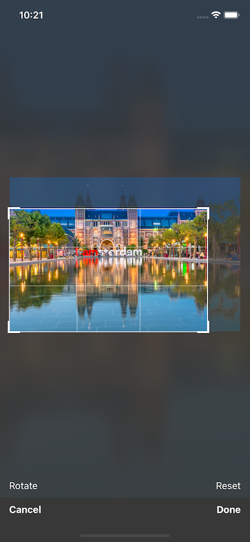

# 📐 react-native-image-cropper

Provides an user interface to crop and rotate (local or remote) images a la iOS Photos or WhatsApp. This package does *not* contain code to perform the actual manipulations. This should be done using another library (e.g. `expo-image-manipulator`) or in the back-end.

This package renders at 60fps by leveraging `react-native-reanimated` and `react-native-gesture-handler` to handle the cropper interactions. This ensures a smooth experience for your users.

## Installation

Before installing, make sure you have `react-native-reanimated@^2` and `react-native-gesture-handler` and configured. No other external dependencies are required.

```sh
yarn add react-native-image-cropper
```
## Usage

The default export is a full-screen component that shows a basic cropping UI. It contains a cancel, done, reset & rotate button.



```js
import CropScreen, { Adustments } from "react-native-image-cropper";

const handleOnCancel = () => {
  // ..
};

const handleOnDone = ({ rotate, originX, originY, width, height }: Adjustments) => {
  // ..
};

<CropScreen onCancel={handleOnCancel} onDone={handleOnDone} source={{ uri: "https://some.remote.example/image.png" }} useBackgroundCover={true} />
```

If you need more flexibility, you can also use the Cropper component directly which you can integrate in your own UI. If using the component, you *MUST* pass in the image dimensions (width, height). See also [src/CropScreen.tsx](src/CropScreen.tsx) for an example implementation.

```js
import * as React from "react";
import { Cropper, Adustments, RotationAngles } from "react-native-image-cropper";

const ref = React.useRef();

/* Following methods are available */
ref.current?.calculateAdjustments(); // --> returns object of shape `Adjustments`
ref.current?.reset();                // --> resets bounding box, rotation to original values
ref.current?.rotate(90);             // --> rotates image. only values in 90 degrees interval are accepted

<Cropper ref={ref} gridlines maxWidth={300} maxHeight={500} source={{ uri: "https://some.remote.example/image.png", width: 1200, height: 750 }} />
```

## Example

Refer to [example/src/App.tsx](example/src/App.tsx) for a working example including integration with expo-image-manipulator.

## Contributing

See the [contributing guide](CONTRIBUTING.md) to learn how to contribute to the repository and the development workflow.

## License

MIT
